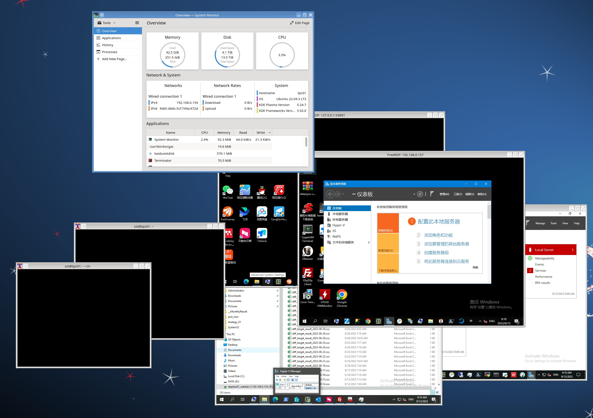
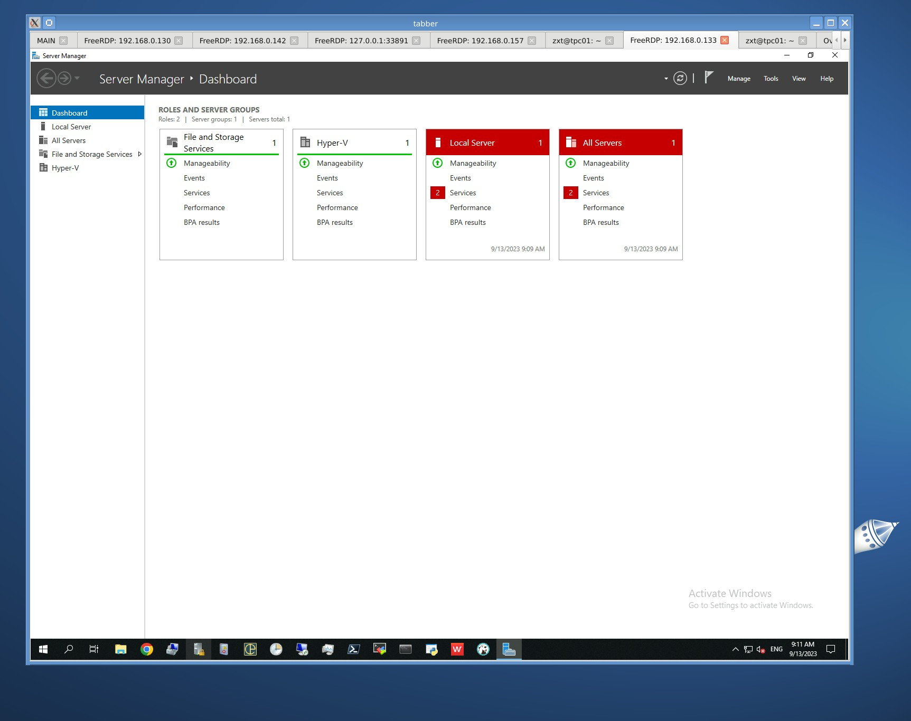
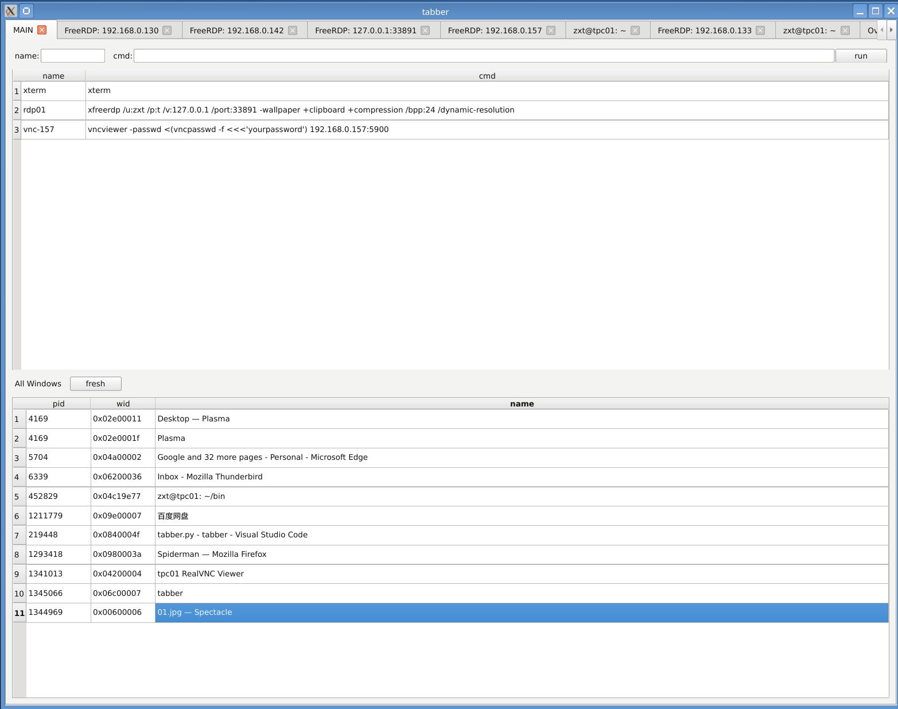

# tabber

*tabber* is a program to manage other program windows to one window as its tabs. The code is very simple and it has only one python file and you can change it easily to fit your own needs.

It can be used as a client manager for rbp/vnc. Actually I used Remmina firstly, but it often crash and can't manager other window such as some terminals. So I write this tool which can manage all windows.

Without *tabber*，windows scatter around in mess

With *tabber*，windows queue up at your hand

## How To Use

* Run command (on the top half)

You can run command by *tabber* and it will manage the window. The command list is in the codes(`CMD_LIST` global variable) and your can add your own ones. Double click and run it.

* Grab window (on the bottom half)

On the bottom it lists all windows on your desktop. Double click one and *tabber* will grab it.

*Hope it is useful for your and have a try !*

